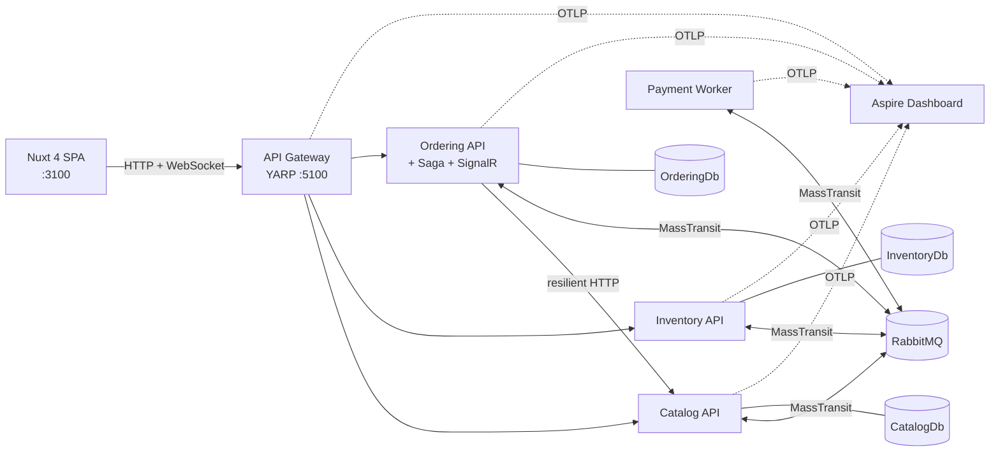

# Microservices Store — .NET 10 + Nuxt 4

[](https://github.com/marlonbochi/microservices_dotnet/actions/workflows/ci.yml)


A small online store split into microservices. It shows how independently deployable services
cooperate in practice, with tested code rather than slides: **database per service, API gateway,
asynchronous messaging, an orchestrated saga with compensation, transactional outbox/inbox,
optimistic concurrency, real-time updates and distributed tracing**.

> Built spec-first with **[Spec Kit](https://github.com/github/spec-kit)**. The
> [constitution](.specify/memory/constitution.md) sets the engineering rules (Clean Code, SOLID,
> microservice principles), and [`specs/001-store-order-flow`](specs/001-store-order-flow) holds the
> spec → plan → tasks trail.



## Highlights

| Concern | How it is solved | Where |
|---------|------------------|-------|
| Service boundaries | 4 bounded contexts, each with its own SQL Server database | `src/Services/*` |
| Cross-service workflow | MassTransit **state machine saga** with a compensating step (release stock when payment is declined) | [`OrderStateMachine`](src/Services/Ordering/Ordering.Infrastructure/Messaging/Sagas/OrderStateMachine.cs) |
| Reliable messaging | EF Core **transactional outbox + inbox**; idempotent handlers | `*/Infrastructure/DependencyInjection.cs` |
| No overselling | `rowversion` optimistic concurrency + retry; verified with **100 concurrent orders for 10 units** | [`ReservationFlowTests`](tests/Inventory.IntegrationTests/ReservationFlowTests.cs) |
| Sync calls done right | Typed `HttpClient` + standard resilience handler (timeout, retry, circuit breaker) → 503 Problem Details | [`CatalogHttpClient`](src/Services/Ordering/Ordering.Infrastructure/Catalog/CatalogHttpClient.cs) |
| Real-time UI | Domain events → SignalR hub → Nuxt order timeline | [`OrdersHub`](src/Services/Ordering/Ordering.Infrastructure/Realtime/OrdersHub.cs) |
| Observability | OpenTelemetry traces/metrics/logs, one trace per order across all services | [`ServiceDefaults`](src/BuildingBlocks/Store.ServiceDefaults/ServiceDefaultsExtensions.cs) |
| Architecture rules | Clean Architecture layers enforced by **NetArchTest** | [`LayerDependencyTests`](tests/Architecture.Tests/LayerDependencyTests.cs) |

## Quick start

Requirements: Docker Desktop with **≥ 6 GB RAM** and about **15 GB of free disk space**.

```bash
docker compose up -d --build
```

| URL | What |
|-----|------|
| http://localhost:3100 | Store UI (Products, Orders, Architecture) |
| http://localhost:5100 | API Gateway |
| http://localhost:5101/scalar · 5102 · 5103 | OpenAPI docs per service (Scalar) |
| http://localhost:15672 | RabbitMQ Management (guest / guest) |
| http://localhost:18888 | Aspire Dashboard (traces, logs, metrics) |

Try it: create a product, place an order and watch it go *Submitted → Stock reserved → Payment approved →
Confirmed* live. Then tick **Simulate payment failure** to see the compensation, or order more than is
in stock to see the rejection. The full walkthrough is in the
[quickstart](specs/001-store-order-flow/quickstart.md).

### Running the services from your IDE

```bash
docker compose up -d sqlserver rabbitmq aspire-dashboard   # infrastructure only
dotnet run --project src/Services/Catalog/Catalog.Api       # :5101
dotnet run --project src/Services/Inventory/Inventory.Api   # :5102
dotnet run --project src/Services/Ordering/Ordering.Api     # :5103
dotnet run --project src/Services/Payment/Payment.Worker    # :5104
dotnet run --project src/Gateway/Store.Gateway              # :5100
cd frontend && npm install && npm run dev                   # :3100
```

## Tests

```bash
dotnet test                                    # everything (integration tests use Testcontainers → Docker)
dotnet test --project tests/Architecture.Tests # architecture rules
dotnet test --project tests/Ordering.UnitTests # domain + every saga transition, no Docker needed
cd frontend && npm test                        # Vitest
```

About 115 .NET tests across unit, messaging (MassTransit test harness), integration (real SQL Server
via Testcontainers) and architecture suites. See [docs/testing.md](docs/testing.md).

## Repository layout

| Path | Contents |
|------|----------|
| `src/BuildingBlocks/Store.Contracts` | Messages exchanged between services (immutable records) |
| `src/BuildingBlocks/Store.SharedKernel` | `Entity`, `AggregateRoot`, `Result`, `Error` (framework-free) |
| `src/BuildingBlocks/Store.ServiceDefaults` | OpenTelemetry, health checks, Problem Details, MassTransit setup |
| `src/Services/Catalog` | Products (Domain / Application / Infrastructure / Api) |
| `src/Services/Inventory` | Stock and reservations |
| `src/Services/Ordering` | Orders, the order saga and the SignalR hub |
| `src/Services/Payment` | Worker simulating a payment provider |
| `src/Gateway/Store.Gateway` | YARP API gateway |
| `frontend/` | Nuxt 4 + Nuxt UI + Pinia |
| `tests/` | Unit, messaging, integration and architecture tests |
| `docs/` | Architecture docs and ADRs |
| `specs/` | Spec Kit artifacts |

## Documentation

- [Architecture](docs/architecture.md): context, layers, sync vs. async communication, consistency
- [Messaging and saga](docs/messaging-and-saga.md): the life of an order, step by step
- [Concepts guide](docs/concepts-guide.md): each microservices concept mapped to the file that implements it, plus exercises
- [Testing strategy](docs/testing.md)
- [Architecture Decision Records](docs/adr)

## Tech stack

.NET 10 · ASP.NET Core Minimal APIs · EF Core 10 · SQL Server 2022 · MassTransit 8 · RabbitMQ 4 ·
YARP · SignalR · OpenTelemetry · Aspire Dashboard · FluentValidation · xUnit v3 · Testcontainers ·
NetArchTest · Nuxt 4 · Nuxt UI 4 · Pinia · Docker Compose · GitHub Actions
