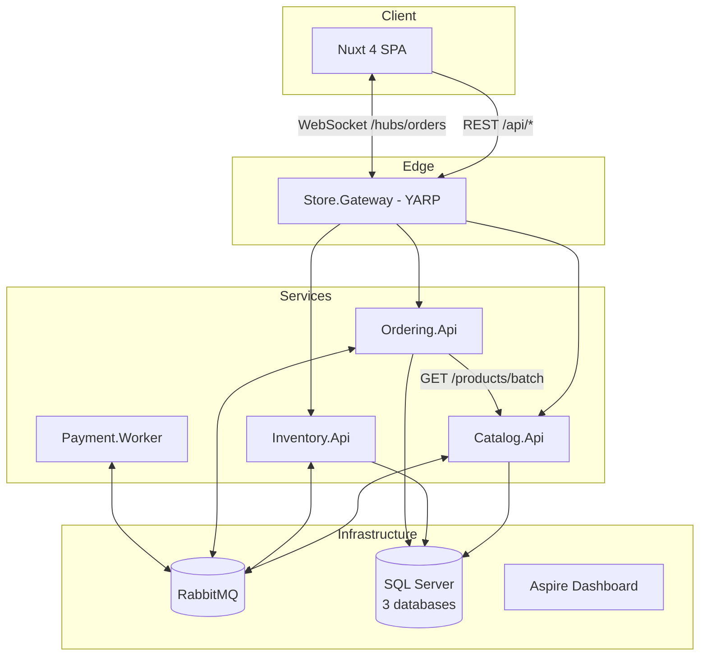
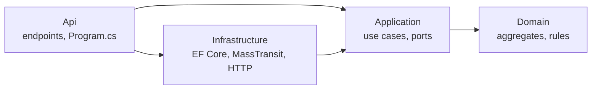

# Architecture

## 1. Context

The system is a demo store split into **four microservices**. Each one owns a *bounded context* of the
business:

| Service | Responsibility | Data owner | Communication |
|---------|----------------|------------|---------------|
| **Catalog** | Products: name, SKU, description, price | `CatalogDb` | REST + publishes events |
| **Inventory** | On-hand, reserved and available stock | `InventoryDb` | REST + consumes/publishes messages |
| **Ordering** | Orders and orchestration of the order process (saga) | `OrderingDb` | REST + SignalR + messages + HTTP to Catalog |
| **Payment** | Charging (simulated) | none (stateless) | Messages only |

An **API Gateway** (YARP) is the frontend's single entry point.

## 2. Why this split?

- **Catalog vs. Inventory**: prices change rarely and are read a lot. Stock changes on every order and
  is contended. Keeping them apart lets each one scale and evolve on its own.
- **Ordering** coordinates the purchase but never touches stock directly. It *asks* Inventory with a
  `ReserveStock` message, so each service keeps ownership of its own rules.
- **Payment** is isolated because in real life it talks to an external provider, which is slow and
  unreliable.

## 3. Inside each service (Clean Architecture)

| Layer | Contains | Must not depend on |
|-------|----------|--------------------|
| **Domain** | Aggregates (`Product`, `StockItem`, `Order`), value objects, domain errors | Any framework |
| **Application** | Command/query handlers, *ports* (`IProductRepository`, `ICatalogClient`...) | EF Core, MassTransit, ASP.NET |
| **Infrastructure** | *Adapters*: DbContext, repositories, consumers, saga, HTTP clients | Api |
| **Api** | Minimal API endpoints, input validation, composition root (DI) | — |

These rules are **checked automatically** by `tests/Architecture.Tests` (NetArchTest).

### SOLID in practice

| Principle | Where to look |
|-----------|---------------|
| **S**ingle Responsibility | One endpoint per class (`CreateProductEndpoint`), one handler per use case (`CreateProductHandler`) |
| **O**pen/Closed | Endpoints are discovered by reflection (`IEndpoint` + `MapEndpoints`), so a new endpoint is a new class and `Program.cs` stays untouched |
| **L**iskov Substitution | `InMemoryInventory` and `FakeCatalogClient` replace the real adapters in tests without changing expected behaviour |
| **I**nterface Segregation | Small ports: `IStockItemRepository`, `IStockReservationRepository`, `IUnitOfWork` |
| **D**ependency Inversion | Application defines `IIntegrationEventPublisher`; Infrastructure implements it with MassTransit (`OutboxEventPublisher`) |

## 4. Shared libraries (and why only these)

Microservices **do not share domain code**. Only three libraries are allowed (constitution,
principle III):

- `Store.Contracts`: message *contracts*, the public asynchronous "API";
- `Store.SharedKernel`: framework-free primitives (`Result`, `Error`, `AggregateRoot`);
- `Store.ServiceDefaults`: cross-cutting host setup (telemetry, health checks, MassTransit).

## 5. Synchronous vs. asynchronous communication

| Style | When we use it | Example |
|-------|----------------|---------|
| **Synchronous HTTP** | A query that needs *fresh, authoritative* data | Ordering → Catalog to read prices at order time |
| **Asynchronous messages** | State changes other services care about; long-running processes | `ProductCreated`, the whole order saga |
| **WebSocket (SignalR)** | Pushing changes to the browser | `OrderStatusChanged` |

The HTTP call uses `AddStandardResilienceHandler()` (timeout, retry with back-off, circuit breaker). If
Catalog is down, placing an order fails fast with a **503 Problem Details** instead of hanging.

## 6. Data and consistency

- **Database per service.** Docker runs a single SQL Server container with three *databases*, which
  already gives logical isolation. In production they could be separate servers.
- **Eventual consistency.** When a product is created, its stock appears a few milliseconds later,
  once Inventory consumes `ProductCreated`. Until then the products screen shows "Syncing via event...".
- **Transactional outbox.** The database write and the message are committed together (see
  [messaging-and-saga.md](messaging-and-saga.md)).
- **Optimistic concurrency.** `StockItem` has a `rowversion` column. When two orders race for the last
  unit, one write wins and the other gets `DbUpdateConcurrencyException`. The message is retried and now
  sees zero stock. A database *check constraint* is the last line of defence.

## 7. Observability

`Store.ServiceDefaults.AddServiceDefaults()` configures every service with:

- **Traces** (ASP.NET Core, HttpClient, SqlClient, MassTransit). An order becomes *one single trace*
  spanning gateway, ordering, inventory and payment, because W3C trace context travels in HTTP headers
  and message headers;
- **Metrics** (runtime, HTTP, MassTransit) and **structured logs**;
- OTLP export to the **Aspire Dashboard** (http://localhost:18888);
- `/health/live` (process is up) and `/health/ready` (database + broker reachable).

## 8. Ports

| Component | Host port |
|-----------|-----------|
| Frontend | 3100 |
| Gateway | 5100 |
| Catalog / Inventory / Ordering / Payment | 5101 / 5102 / 5103 / 5104 |
| SQL Server | 14330 |
| RabbitMQ AMQP / UI | 5672 / 15672 |
| Aspire Dashboard UI / OTLP | 18888 / 4317 |

## 9. Out of scope (and how to evolve)

- **Authentication/authorization**: add an identity provider (Keycloak, Entra ID) and validate JWTs at the gateway.
- **Saga timeout**: schedule a `PaymentTimeout` with the message scheduler (RabbitMQ delayed-exchange plugin).
- **Production migrations**: run EF *migration bundles* in a separate job instead of at startup.
- **Deployment**: Kubernetes/Helm or .NET Aspire orchestration; multiple Inventory replicas to exercise cross-instance concurrency.
- **Read-side caching**: keep a local price replica in Ordering via `ProductUpdated`, trading strong consistency for availability.
