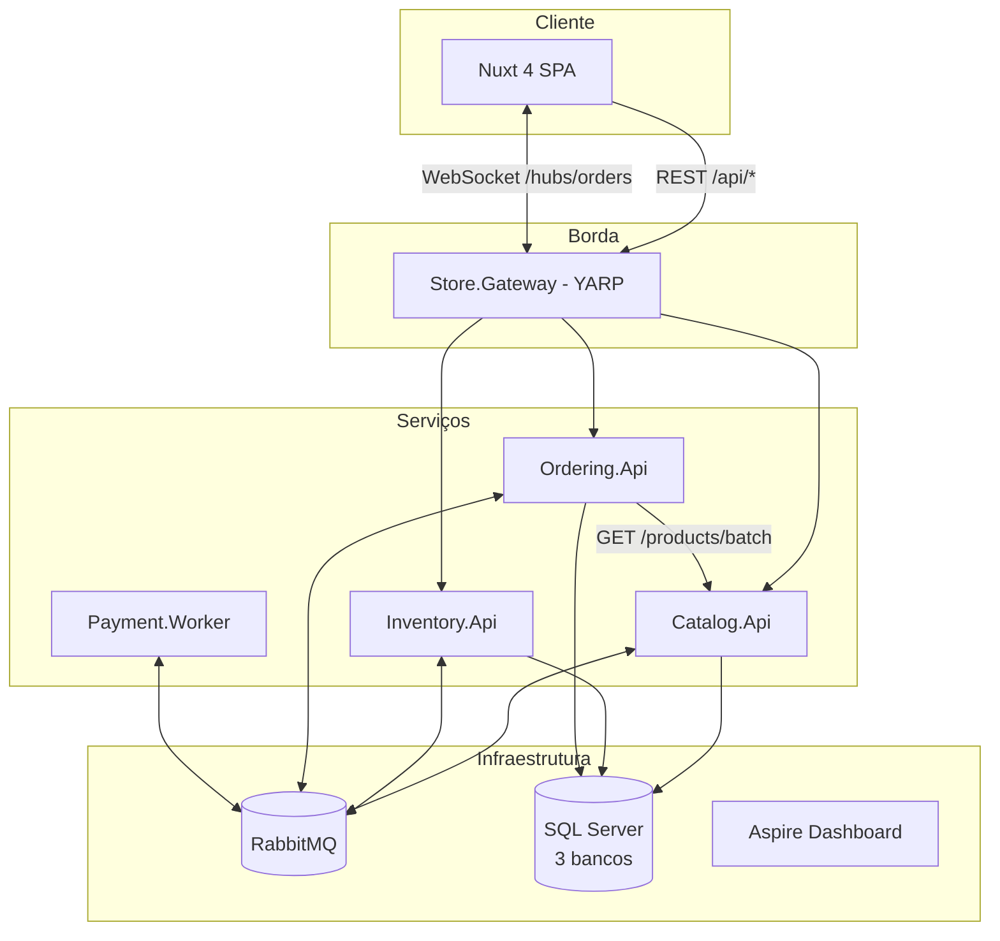
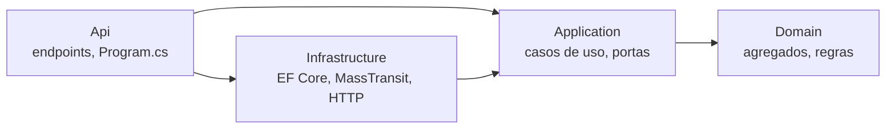

# Arquitetura

## 1. Visão de contexto

O sistema é uma loja de demonstração dividida em **quatro microsserviços**, cada um responsável por um
*bounded context* (contexto delimitado) do negócio:

| Serviço | Responsabilidade | Dono dos dados | Comunicação |
|---------|------------------|----------------|-------------|
| **Catalog** | Produtos: nome, SKU, descrição, preço | `CatalogDb` | REST + publica eventos |
| **Inventory** | Estoque físico, reservado e disponível | `InventoryDb` | REST + consome/publica mensagens |
| **Ordering** | Pedidos e orquestração do processo (saga) | `OrderingDb` | REST + SignalR + mensagens + HTTP para o Catalog |
| **Payment** | Cobrança (simulada) | — (stateless) | Somente mensagens |

Um **API Gateway** (YARP) é a única porta de entrada do frontend.

## 2. Por que dividir assim?

- **Catalog × Inventory**: preço muda raramente e é lido muito; estoque muda a cada pedido e sofre
  concorrência. Separá-los permite escalar e evoluir cada um sem afetar o outro.
- **Ordering** coordena o processo de compra, mas **não** mexe no estoque diretamente: ele *pede* ao
  Inventory (mensagem `ReserveStock`). Cada serviço é dono das próprias regras.
- **Payment** é isolado porque, na vida real, integra com um provedor externo (lento, instável).

## 3. Arquitetura interna de cada serviço (Clean Architecture)

| Camada | Contém | Não pode depender de |
|--------|--------|----------------------|
| **Domain** | Agregados (`Product`, `StockItem`, `Order`), value objects, erros de domínio | Nada de framework |
| **Application** | Handlers de comandos/consultas, *portas* (`IProductRepository`, `ICatalogClient`...) | EF Core, MassTransit, ASP.NET |
| **Infrastructure** | *Adaptadores*: DbContext, repositórios, consumidores, saga, clientes HTTP | Api |
| **Api** | Endpoints Minimal API, validação de entrada, composição (DI) | — |

Essas regras são **verificadas automaticamente** por `tests/Architecture.Tests` (NetArchTest).

### SOLID na prática

| Princípio | Onde ver |
|-----------|----------|
| **S**ingle Responsibility | Um endpoint por classe (`CreateProductEndpoint`), um handler por caso de uso (`CreateProductHandler`) |
| **O**pen/Closed | Endpoints descobertos por reflexão (`IEndpoint` + `MapEndpoints`): novo endpoint = nova classe, sem editar `Program.cs` |
| **L**iskov | `InMemoryInventory` e `FakeCatalogClient` substituem os adaptadores reais nos testes sem mudar o comportamento esperado |
| **I**nterface Segregation | Portas pequenas: `IStockItemRepository`, `IStockReservationRepository`, `IUnitOfWork` |
| **D**ependency Inversion | Application define `IIntegrationEventPublisher`; Infrastructure implementa com MassTransit (`OutboxEventPublisher`) |

## 4. Bibliotecas compartilhadas (e por que só essas)

Microsserviços **não compartilham código de domínio**. Apenas três bibliotecas são permitidas
(constituição, princípio III):

- `Store.Contracts`: os *contratos* de mensagem, como um "schema" público;
- `Store.SharedKernel`: primitivas sem framework (`Result`, `Error`, `AggregateRoot`);
- `Store.ServiceDefaults`: configuração transversal de host (telemetria, health checks, MassTransit).

## 5. Comunicação síncrona × assíncrona

| Tipo | Quando usamos | Exemplo |
|------|---------------|---------|
| **HTTP síncrono** | Consulta que precisa de dado *fresco e autoritativo* | Ordering → Catalog para ler preços no momento do pedido |
| **Mensagens assíncronas** | Mudanças de estado que outros serviços precisam saber; processos longos | `ProductCreated`, toda a saga do pedido |
| **WebSocket (SignalR)** | Empurrar mudanças para o navegador | `OrderStatusChanged` |

A chamada HTTP usa `AddStandardResilienceHandler()` (timeout, retry com backoff e circuit breaker). Se o
Catalog cair, o pedido falha rápido com **503 Problem Details**, sem travar.

## 6. Dados e consistência

- **Um banco por serviço**. No Docker usamos um único container SQL Server com três *databases*, o
  que já garante o isolamento lógico. Em produção poderiam ser servidores diferentes.
- **Consistência eventual**: ao criar um produto, o estoque aparece alguns milissegundos depois,
  quando o Inventory consome `ProductCreated`. A tela de produtos mostra "Sincronizando via evento..."
  enquanto isso.
- **Outbox transacional**: a gravação no banco e a mensagem são confirmadas juntas (ver
  [mensageria-e-saga.md](mensageria-e-saga.md)).
- **Concorrência otimista**: `StockItem` tem uma coluna `rowversion`. Dois pedidos simultâneos para a
  última unidade → um grava, o outro recebe `DbUpdateConcurrencyException`, a mensagem é reprocessada
  e agora vê estoque 0. Um *check constraint* no banco é a última linha de defesa.

## 7. Observabilidade

`Store.ServiceDefaults.AddServiceDefaults()` configura, em todos os serviços:

- **Traces** (ASP.NET Core, HttpClient, SqlClient, MassTransit) → um pedido vira *um único trace*
  atravessando gateway, ordering, inventory e payment (o contexto W3C viaja nos headers HTTP e nas
  mensagens);
- **Métricas** (runtime, HTTP, MassTransit) e **logs estruturados**;
- exportação OTLP para o **Aspire Dashboard** (http://localhost:18888);
- `/health/live` (processo vivo) e `/health/ready` (banco + broker).

## 8. Portas

| Componente | Porta no host |
|------------|---------------|
| Frontend | 3100 |
| Gateway | 5100 |
| Catalog / Inventory / Ordering / Payment | 5101 / 5102 / 5103 / 5104 |
| SQL Server | 14330 |
| RabbitMQ AMQP / UI | 5672 / 15672 |
| Aspire Dashboard | 18888 |

## 9. O que ficou de fora (e como evoluir)

- **Autenticação/autorização**: adicionar um Identity Provider (Keycloak/Entra ID) e validar JWT no gateway.
- **Timeout da saga**: agendar `PaymentTimeout` com o *message scheduler* (plugin delayed-exchange do RabbitMQ).
- **Migrations em produção**: usar *migration bundles* em um job separado, não na inicialização.
- **Deploy**: Kubernetes/Helm ou .NET Aspire para orquestração; réplicas do Inventory para testar a concorrência entre instâncias.
- **Cache de leitura**: réplica local de preços no Ordering via `ProductUpdated` (troca consistência forte por disponibilidade).
