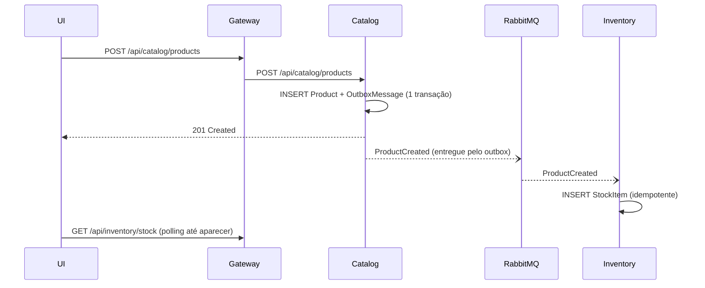
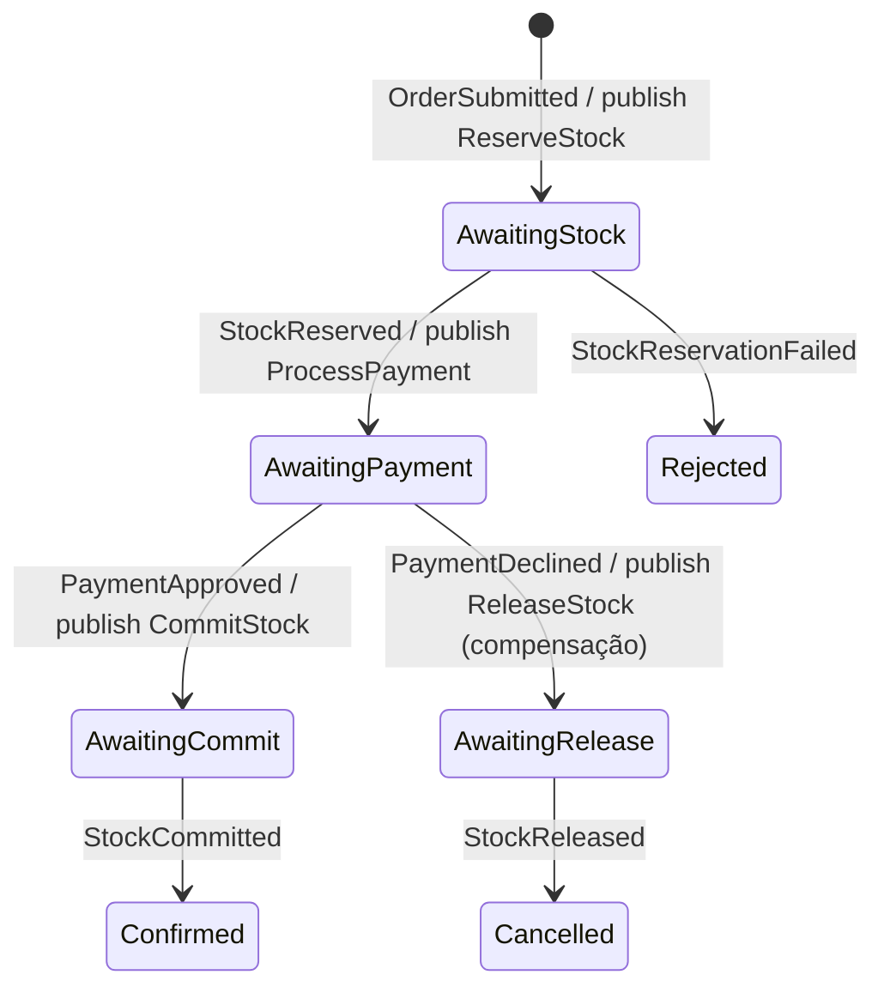
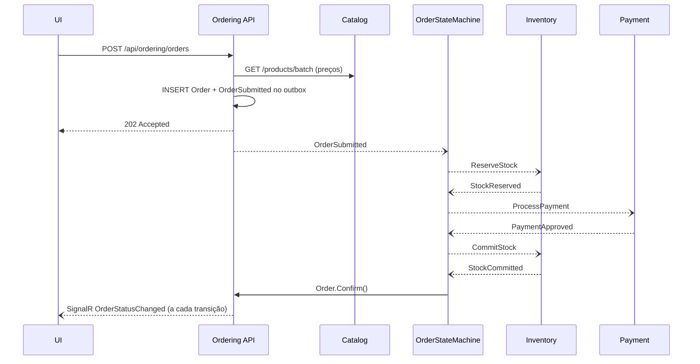

# Mensageria e Saga: a vida de um pedido

## 1. Conceitos rápidos

| Conceito | Em uma frase | No código |
|----------|--------------|-----------|
| **Evento** | "Algo aconteceu" (passado), publicado para quem quiser ouvir | `ProductCreated`, `StockReserved` |
| **Comando** | "Faça isto" (imperativo), com um destinatário lógico | `ReserveStock`, `ProcessPayment` |
| **Publish/Subscribe** | Quem publica não conhece quem consome | `IPublishEndpoint.Publish(...)` |
| **Consumer** | Classe que reage a uma mensagem | `ReserveStockConsumer` |
| **Saga** | Processo de negócio longo, com estado, que coordena vários serviços | `OrderStateMachine` |
| **Compensação** | Ação que desfaz um passo anterior quando algo falha depois | `ReleaseStock` |
| **Outbox** | Grava a mensagem na mesma transação do banco; um processo envia depois | tabelas `OutboxMessage`/`OutboxState` |
| **Inbox** | Registra mensagens já processadas para ignorar duplicatas | tabela `InboxState` |
| **Dead-letter** | Fila para mensagens que falharam mesmo após as tentativas | filas `*_error` no RabbitMQ |

Os contratos estão em [`Store.Contracts`](../src/BuildingBlocks/Store.Contracts) e documentados em
[`contracts/messages.md`](../specs/001-store-order-flow/contracts/messages.md).

## 2. Topologia no RabbitMQ

O MassTransit cria a topologia automaticamente (`ConfigureEndpoints` + nomes *kebab-case*):

- um **exchange por tipo de mensagem** (ex.: `Store.Contracts.Inventory:ReserveStock`);
- uma **fila por consumidor** (ex.: `reserve-stock`, `product-created`, `order-state`);
- bindings exchange → fila para cada consumidor interessado;
- filas `<fila>_error` (dead-letter) e `<fila>_skipped`.

Abra http://localhost:15672 → *Queues* depois de subir o sistema para ver tudo isso.

## 3. Cadastro de produto (evento simples + consistência eventual)

## 4. Pedido: a saga orquestrada

`OrderStateMachine` ([código](../src/Services/Ordering/Ordering.Infrastructure/Messaging/Sagas/OrderStateMachine.cs))
é uma máquina de estados persistida na tabela `ordering.OrderSagas`:

Caminho feliz completo:

### Por que `202 Accepted` e não `201 Created`?

O pedido foi **aceito**, mas ainda não foi **processado**. O resultado final chega de forma assíncrona
(SignalR ou `GET /orders/{id}`). Esse é o padrão natural de sistemas orientados a mensagens.

### Saga × agregado `Order`

- `OrderState` (saga) guarda o **estado técnico do processo** (em que passo estamos, total, flag de falha).
- `Order` (domínio) é o **registro de negócio** exposto pela API, com linha do tempo e regras de transição.
- A atividade [`SyncOrderStatusActivity`](../src/Services/Ordering/Ordering.Infrastructure/Messaging/Sagas/SyncOrderStatusActivity.cs)
  espelha cada transição no `Order` **usando o mesmo DbContext**: estado da saga, status do pedido e
  mensagens de saída são confirmados na **mesma transação**.
- O `Order` levanta `OrderStatusChangedDomainEvent`; o `OrderingDbContext` despacha esse evento **depois**
  do `SaveChanges`, e o handler `NotifyOrderStatusChanged` empurra a mudança via SignalR.

## 5. Falhas e compensação

| Cenário | O que acontece |
|---------|----------------|
| Estoque insuficiente | Inventory publica `StockReservationFailed`; nada foi reservado (tudo-ou-nada); pedido → **Rejected** |
| Pagamento recusado | Payment publica `PaymentDeclined`; saga publica `ReleaseStock` (compensação); Inventory devolve as unidades; pedido → **Cancelled** |
| Mensagem duplicada | Inbox (MessageId) descarta; handlers também são idempotentes por chave de negócio (`OrderId`) |
| Evento fora de ordem ou atrasado | `OnUnhandledEvent(Ignore)` na saga; `OnMissingInstance(Discard)` para pedidos desconhecidos |
| Conflito de concorrência | `DbUpdateConcurrencyException` → retry exponencial (até 10x) com um novo escopo/DbContext |
| Erro persistente | Após as tentativas, a mensagem vai para a fila `_error` (dead-letter) para análise |
| Payment fora do ar | `ProcessPayment` fica na fila (durável); o pedido segue quando o serviço volta |
| Ordering reinicia no meio | O estado da saga está no banco; o processo continua de onde parou |

## 6. Outbox em detalhe

**Problema (dual write)**: `SaveChanges()` e `Publish()` são duas operações em sistemas diferentes. Se o
processo cair entre elas, o banco e o broker ficam inconsistentes.

**Solução**:

1. **Bus outbox** (Catalog e Ordering, dentro de requisições HTTP): `Publish` grava em `OutboxMessage`
   dentro do mesmo `SaveChanges` do agregado. Um *delivery service* em background lê a tabela e envia ao
   RabbitMQ.
2. **Consumer outbox + inbox** (Inventory e Ordering, dentro de consumidores): a mensagem recebida é
   registrada em `InboxState` (deduplicação) e as mensagens publicadas durante o consumo só saem depois do
   commit.

Configuração: `AddEntityFrameworkOutbox<TDbContext>(...)` e `UseEntityFrameworkOutbox<TDbContext>(...)`
nos arquivos `DependencyInjection.cs` de cada Infrastructure.

## 7. Retry e dead-letter

Definidos em [`MessagingExtensions`](../src/BuildingBlocks/Store.ServiceDefaults/Messaging/MessagingExtensions.cs):
retry exponencial de 50 ms até 5 s, com até 10 tentativas, registrado como *endpoint callback*. Assim ele
vale tanto para o RabbitMQ quanto para o harness em memória dos testes e fica **antes** do outbox, de modo
que cada tentativa ganha um escopo e um `DbContext` novos.
