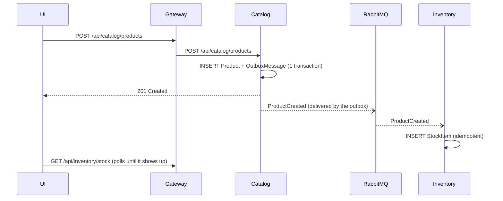
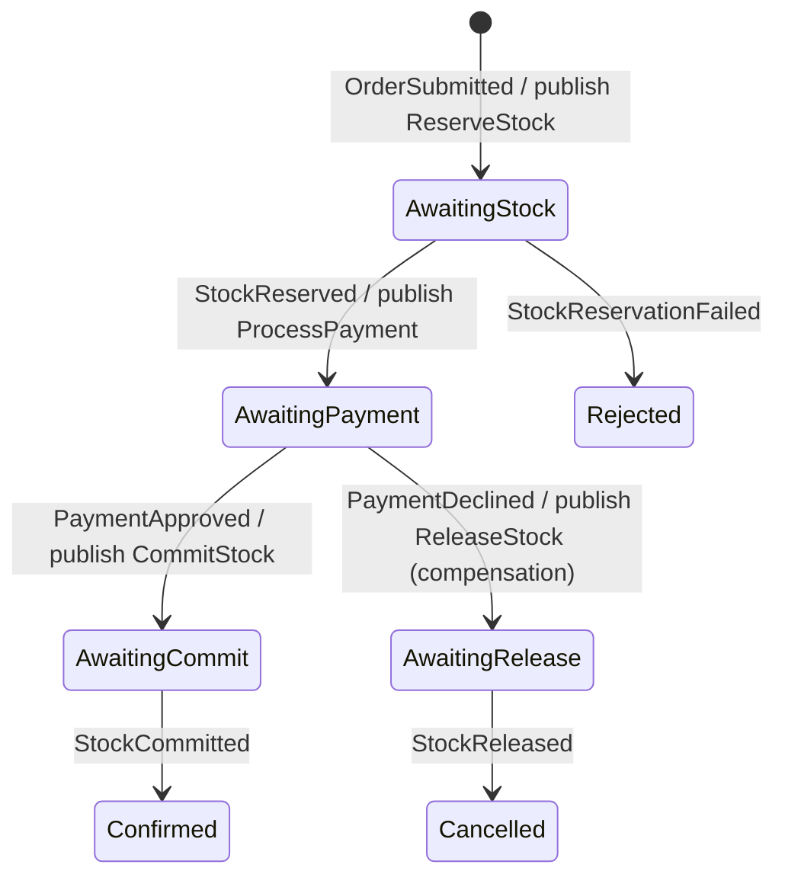
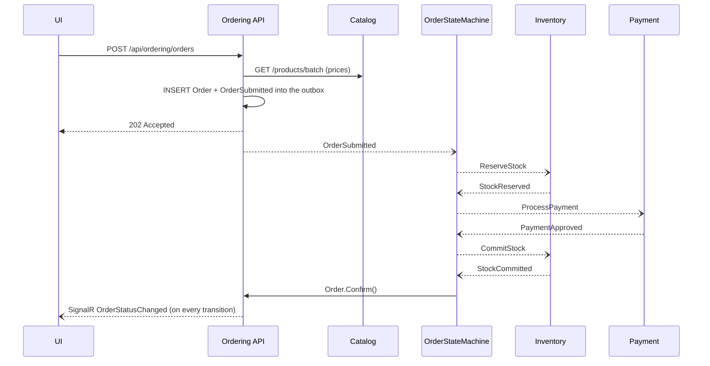

# Messaging and Saga: the life of an order

## 1. Key concepts

| Concept | In one sentence | In the code |
|---------|-----------------|-------------|
| **Event** | "Something happened" (past tense), published to whoever wants to listen | `ProductCreated`, `StockReserved` |
| **Command** | "Do this" (imperative), with one logical recipient | `ReserveStock`, `ProcessPayment` |
| **Publish/Subscribe** | The publisher does not know who consumes | `IPublishEndpoint.Publish(...)` |
| **Consumer** | A class that reacts to a message | `ReserveStockConsumer` |
| **Saga** | A long-running, stateful business process that coordinates several services | `OrderStateMachine` |
| **Compensation** | An action that undoes an earlier step when a later one fails | `ReleaseStock` |
| **Outbox** | Stores the message in the same DB transaction; a background process sends it later | `OutboxMessage`/`OutboxState` tables |
| **Inbox** | Records processed messages so duplicates are ignored | `InboxState` table |
| **Dead-letter** | Where messages go when they still fail after all retries | `*_error` queues in RabbitMQ |

Contracts live in [`Store.Contracts`](../src/BuildingBlocks/Store.Contracts) and are documented in
[`contracts/messages.md`](../specs/001-store-order-flow/contracts/messages.md).

## 2. RabbitMQ topology

MassTransit creates the topology automatically (`ConfigureEndpoints` + *kebab-case* names):

- one **exchange per message type** (e.g. `Store.Contracts.Inventory:ReserveStock`);
- one **queue per consumer** (e.g. `reserve-stock`, `product-created`, `order-state`);
- exchange → queue bindings for every interested consumer;
- `<queue>_error` (dead-letter) and `<queue>_skipped` queues.

Once the system is running, open http://localhost:15672 → *Queues* to see all of this.

## 3. Creating a product (simple event + eventual consistency)

## 4. Placing an order: the orchestrated saga

`OrderStateMachine` ([code](../src/Services/Ordering/Ordering.Infrastructure/Messaging/Sagas/OrderStateMachine.cs))
is a state machine persisted in the `ordering.OrderSagas` table:

The full happy path:

### Why `202 Accepted` instead of `201 Created`?

The order has been **accepted** but not yet **processed**. The final outcome arrives asynchronously,
through SignalR or `GET /orders/{id}`. That is the natural pattern of message-driven systems.

### Saga vs. the `Order` aggregate

- `OrderState` (saga) holds the **technical process state**: which step we are on, the total, the failure flag.
- `Order` (domain) is the **business record** exposed by the API, with its timeline and transition rules.
- The [`SyncOrderStatusActivity`](../src/Services/Ordering/Ordering.Infrastructure/Messaging/Sagas/SyncOrderStatusActivity.cs)
  mirrors each transition onto the `Order` **using the same DbContext**. Saga state, order status and
  outgoing messages are committed in **one transaction**.
- `Order` raises `OrderStatusChangedDomainEvent`. `OrderingDbContext` dispatches it **after**
  `SaveChanges`, and the `NotifyOrderStatusChanged` handler pushes the change through SignalR.

## 5. Failures and compensation

| Scenario | What happens |
|----------|--------------|
| Insufficient stock | Inventory publishes `StockReservationFailed`; nothing was reserved (all-or-nothing); order → **Rejected** |
| Payment declined | Payment publishes `PaymentDeclined`; the saga publishes `ReleaseStock` (compensation); Inventory gives the units back; order → **Cancelled** |
| Duplicate message | The inbox (MessageId) drops it; handlers are also idempotent by business key (`OrderId`) |
| Late or out-of-order event | `OnUnhandledEvent(Ignore)` in the saga; `OnMissingInstance(Discard)` for unknown orders |
| Concurrency conflict | `DbUpdateConcurrencyException` → exponential retry (up to 10 attempts) with a fresh scope/DbContext |
| Persistent error | After all retries the message goes to the `_error` queue (dead-letter) for inspection |
| Payment is down | `ProcessPayment` waits in its durable queue; the order resumes when the service is back |
| Ordering restarts mid-process | The saga state is in the database, so the process resumes where it stopped |

## 6. The outbox in detail

**The problem (dual write).** `SaveChanges()` and `Publish()` are two operations on two different
systems. If the process dies between them, the database and the broker disagree.

**The solution:**

1. **Bus outbox** (Catalog and Ordering, inside HTTP requests): `Publish` writes to `OutboxMessage` in
   the same `SaveChanges` as the aggregate. A background delivery service reads the table and sends to
   RabbitMQ.
2. **Consumer outbox + inbox** (Inventory and Ordering, inside consumers): the incoming message is
   recorded in `InboxState` (de-duplication), and messages published while consuming are only sent
   after the commit.

Configuration: `AddEntityFrameworkOutbox<TDbContext>(...)` and `UseEntityFrameworkOutbox<TDbContext>(...)`
in each Infrastructure `DependencyInjection.cs`. The outbox transaction runs at `ReadCommitted`. The
default `RepeatableRead` deadlocked concurrent reservations, and `rowversion` already prevents lost
updates (see [ADR 0005](adr/0005-optimistic-concurrency-for-stock.md)).

## 7. Retry and dead-letter

Defined in [`MessagingExtensions`](../src/BuildingBlocks/Store.ServiceDefaults/Messaging/MessagingExtensions.cs):
exponential retry from 50 ms to 5 s, up to 10 attempts. It is registered as an *endpoint callback*, so it
applies both to RabbitMQ and to the in-memory test harness. It also runs **before** the outbox, so every
attempt gets a fresh scope and `DbContext`.
