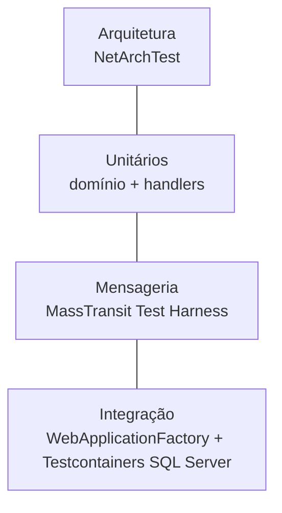

# Estratégia de testes



| Projeto | Tipo | Precisa de Docker? | O que cobre |
|---------|------|--------------------|-------------|
| `Architecture.Tests` | Arquitetura | Não | Direção das camadas, nenhum serviço referencia outro, classes `sealed` |
| `Catalog.UnitTests` | Unitário | Não | `Product`, `Sku`, handlers de criação/atualização (NSubstitute) |
| `Inventory.UnitTests` | Unitário + harness | Não | `StockItem`, `StockReservation`, reserva tudo-ou-nada, idempotência, consumidores |
| `Ordering.UnitTests` | Unitário + harness | Não | `Order` (transições), `PlaceOrderHandler`, **todas as transições da saga** |
| `Payment.UnitTests` | Unitário + harness | Não | Gateway fake e consumidor |
| `Catalog.IntegrationTests` | Integração | Sim | Endpoints reais + SQL real + eventos publicados via outbox |
| `Inventory.IntegrationTests` | Integração | Sim | Fluxo de reservas no SQL real, **100 reservas concorrentes sem overselling** |
| `Ordering.IntegrationTests` | Integração | Sim | Saga completa com repositório EF + SQL real (confirmado, rejeitado, cancelado) |
| `frontend/tests` | Unitário (Vitest) | Não | Formatação e mapeamento de status |

## Como rodar

```bash
dotnet test                                          # tudo
dotnet test --project tests/Ordering.UnitTests       # um projeto
dotnet test --filter-trait "Category=Integration"    # só integração (xUnit v3 / MTP)
dotnet test -- --coverage --coverage-output-format cobertura   # cobertura (Microsoft.Testing.Platform)
```

O repositório usa o **Microsoft.Testing.Platform** (configurado em `global.json`), o runner moderno
do .NET 10, com xUnit v3.

## Padrões usados

- **AAA** (Arrange, Act, Assert) e nomes `Metodo_Cenario_ResultadoEsperado`.
- **Fakes em memória em vez de mocks** quando o comportamento importa (`InMemoryInventory` simula até o
  outbox: mensagens só "saem" no `SaveChangesAsync`).
- **Test Harness do MassTransit**: serialização, pipeline e roteamento reais sem RabbitMQ.
- **Testcontainers**: cada classe de integração sobe um SQL Server descartável. Nada de EF InMemory,
  que não respeita `rowversion`, *check constraints* nem transações.
- **`Eventually`**: sistemas assíncronos são eventualmente consistentes, então os testes fazem polling com timeout
  em vez de usar `Thread.Sleep`.
- A infraestrutura compartilhada de integração fica em `tests/Shared` (incluída por link nos projetos).
