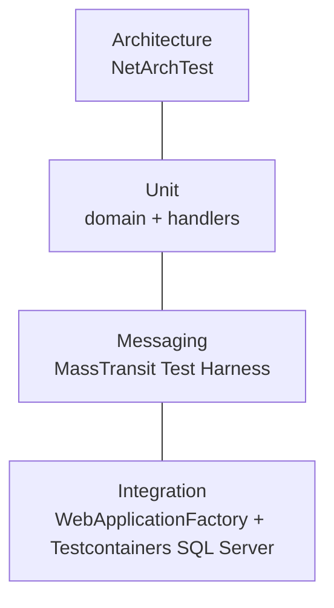

# Testing strategy



| Project | Kind | Needs Docker? | Covers |
|---------|------|---------------|--------|
| `Architecture.Tests` | Architecture | No | Layer direction, no service references another, `sealed` classes |
| `Catalog.UnitTests` | Unit | No | `Product`, `Sku`, create/update handlers (NSubstitute) |
| `Inventory.UnitTests` | Unit + harness | No | `StockItem`, `StockReservation`, all-or-nothing reservation, idempotency, consumers |
| `Ordering.UnitTests` | Unit + harness | No | `Order` transitions, `PlaceOrderHandler`, **every saga transition** |
| `Payment.UnitTests` | Unit + harness | No | Fake gateway and consumer |
| `Catalog.IntegrationTests` | Integration | Yes | Real endpoints + real SQL + events published through the outbox |
| `Inventory.IntegrationTests` | Integration | Yes | Reservation flow on real SQL, **100 concurrent reservations without overselling** |
| `Ordering.IntegrationTests` | Integration | Yes | Full saga with the EF repository on real SQL (confirmed, rejected, cancelled) |
| `frontend/tests` | Unit (Vitest) | No | Formatting and status mapping |

## Running

```bash
dotnet test                                          # everything
dotnet test --project tests/Ordering.UnitTests       # one project
dotnet test --filter-trait "Category=Integration"    # integration only (xUnit v3 / MTP)
dotnet test -- --coverage --coverage-output-format cobertura   # coverage (Microsoft.Testing.Platform)
```

The repository uses **Microsoft.Testing.Platform** (configured in `global.json`), the modern .NET 10
test runner, with xUnit v3.

## Patterns

- **AAA** (Arrange, Act, Assert) and `Method_Scenario_ExpectedResult` names.
- **In-memory fakes instead of mocks** when behaviour matters. `InMemoryInventory` even mimics the
  outbox: messages are only "published" on `SaveChangesAsync`.
- **MassTransit Test Harness**: real serialization, pipeline and routing without RabbitMQ.
- **Testcontainers**: each integration test class starts a throwaway SQL Server. EF InMemory is not used,
  because it ignores `rowversion`, check constraints and transactions.
- **Capture consumers** (`MessageCapture<T>`) stand in for downstream services. The outbox re-sends
  messages as raw bytes, so the only reliable typed assertion is that the message was *consumed*,
  which also proves it really crossed the transport.
- **`Eventually`**: asynchronous systems are eventually consistent, so tests poll with a timeout instead
  of calling `Thread.Sleep`.
- Shared integration infrastructure lives in `tests/Shared`, linked into each project.
